# 🏦 Home Credit Default Risk Analysis & Prediction

Bu proje, **Home Credit** verilerini kullanarak kredi geri ödeme risklerini tahmin eden, **uçtan uca (End-to-End)** bir veri bilimi projesidir. Proje, **Agile (Çevik)** yöntemler kullanılarak bir veri bilimi ekibi tarafından gerçekleştirilmiştir.

**Amaç:** Banka hesabı olmayan (unbanked) nüfusun kredi skorlarını alternatif verilerle hesaplayarak, finansal kapsayıcılığı artırmak ve bankanın batık kredi riskini minimize etmektir.

---

## 🤝 Project Management & Collaboration

Bu proje, görev dağılımı ve süreç takibi için **Trello** kullanılarak, takım çalışması prensipleriyle yönetilmiştir.

* **Yöntem:** Agile / Scrum prensipleri
* **Süreç Takibi:** Backlog, To-Do, In Progress, Done aşamaları
* **İletişim:** Düzenli sprint toplantıları ve kod incelemeleri (Code Reviews)

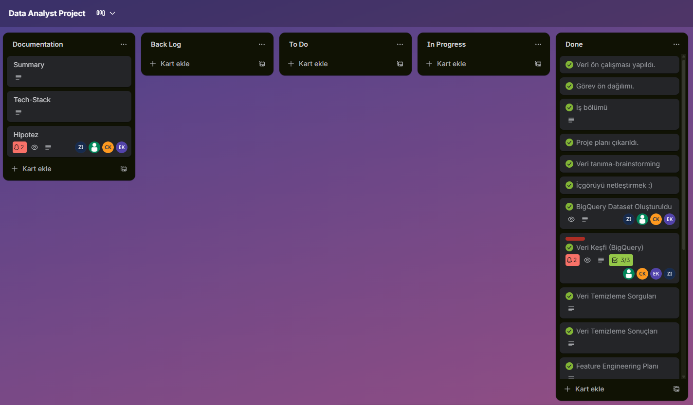

---

## 🛠️ Tools & Technologies

Projede kullanılan teknoloji yığını (Tech Stack):

* **Project Management:** Trello
* **Data Warehouse & SQL:** Google Cloud BigQuery
* **Descriptive Analytics & BI:** Google Looker Studio
* **Programming:** Python (Google Colab)
* **Machine Learning:** LightGBM (Gradient Boosting)
* **Explainable AI (XAI):** SHAP
* **Libraries:** Pandas, NumPy, Scikit-learn, Matplotlib, Seaborn

---

## 📊 Project Workflow

Veri bilimi yaşam döngüsü (DSLC) şu 5 ana aşamada uygulanmıştır:

1.  **Veri Keşfi & Betimsel Analiz:** **Looker Studio** ve SQL kullanılarak verinin genel yapısı, eksiklikler ve dağılımlar görselleştirildi.
2.  **Veri Mühendisliği (Feature Engineering):** İş zekası kullanılarak `NEW_CREDIT_TO_ANNUITY_RATIO` gibi türetilmiş değişkenler oluşturuldu.
3.  **Veri Hazırlığı:** Kategorik dönüşümler (Encoding) ve eksik veri stratejileri uygulandı.
4.  **Model Eğitimi:** **LightGBM** algoritması ve **5-Fold Cross Validation** ile model eğitildi.
5.  **Değerlendirme & Yorumlama:** SHAP analizi ile modelin "Kara Kutu" yapısı çözüldü ve iş kararları üretildi.

---

## 🏆 Key Results (Model Performansı)

Modelimiz, validasyon verisi üzerinde **0.78 AUC Skoru** ile yüksek bir ayrıştırma gücüne ulaşmıştır.

### 1. Model Başarısı ve Ayrıştırma Gücü (ROC & Probability)
Model, borcunu ödeyecek müşteriler ile batacak olanları **%78 başarı oranıyla** birbirinden ayırt edebilmektedir.
* **Soldaki Grafik:** ROC eğrisinin sol üst köşeye yakınlığı modelin başarısını gösterir.
* **Sağdaki Grafik:** Mavi (Ödeyecek) ve Kırmızı (Batacak) dağılımların birbirinden ayrışması, modelin karar netliğini kanıtlar.

| ROC Eğrisi | Olasılık Dağılımı |
|------------|-------------------|
| 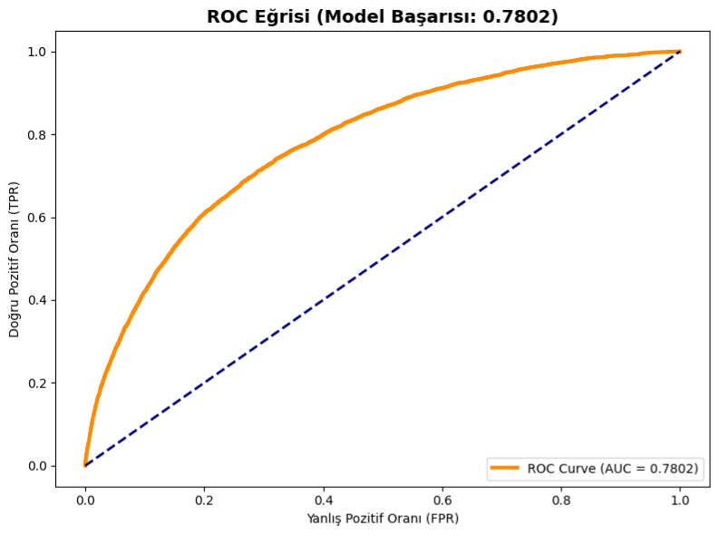 | 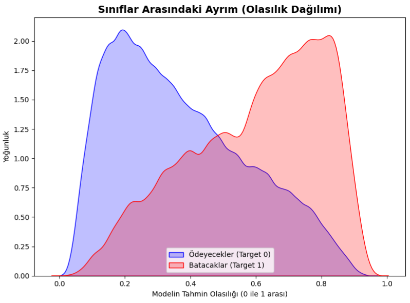 |

### 2. Finansal Etki Analizi (Confusion Matrix)
Modelin ticari etkisi simüle edildiğinde (Threshold: 0.50):
* **Risk Yönetimi:** 3.400+ potansiyel batık kredi (True Positive) tespit edilerek bankanın zararı önlenmiştir.
* **Doğruluk:** Güvenli müşterileri tespit etme başarısı yüksektir.

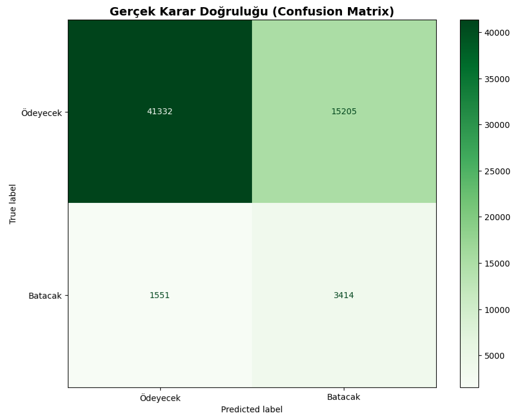

---

## 💡 Key Insights (İş İçgörüleri)

SHAP analizi, Korelasyon ve Feature Importance grafikleri üzerinden elde edilen kritik iş içgörüleri:

### 🔍 1. Karar Mekanizması (SHAP & Feature Importance)
Model kararlarını etkileyen en önemli faktörler şunlardır:
* 📌 **Dış Veri Güveni:** Modelin en çok önem verdiği özellik `EXT_SOURCE` (Dış Kredi Skoru) olmuştur.
* 📌 **Vade Riski:** `CREDIT_TO_ANNUITY_RATIO` (Kredi/Taksit) oranı arttıkça, yani vade uzadıkça müşterinin batma riski artmaktadır.

| SHAP Özellik Analizi | LightGBM Özellik Önemi |
|----------------------|------------------------|
| 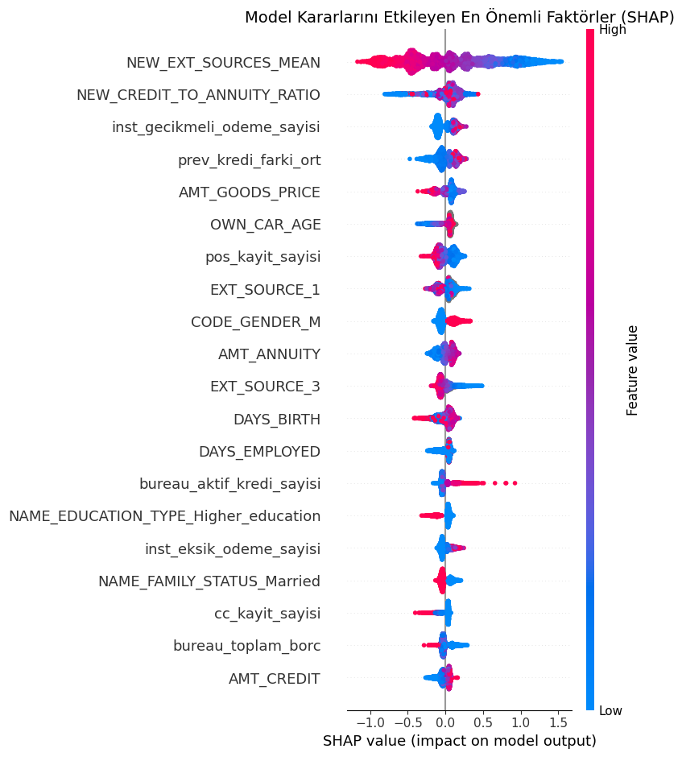 | 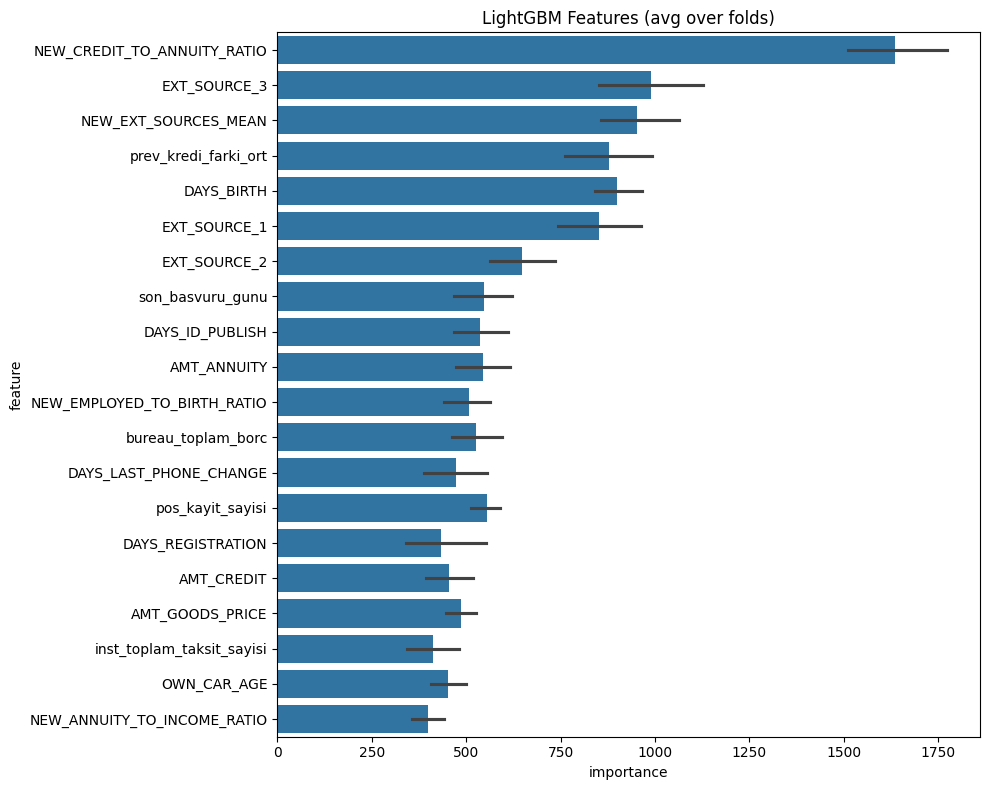 |

### 📈 2. Veri İlişkileri ve Risk Analizi
* **Veri Tutarlılığı:** Aşağıdaki Korelasyon matrisi, değişkenler arasındaki mantıksal ilişkileri doğrulamaktadır (Örn: `AMT_GOODS_PRICE` ve `AMT_ANNUITY` arasındaki güçlü ilişki).
* **Risk Profili:** Medeni durum ve risk analizi grafiğinde görüldüğü üzere, "Bekar" müşterilerin risk oranı, "Evli" ve "Dul" grubuna göre daha yüksektir.

| Korelasyon Matrisi | Risk Dağılım Analizi |
|--------------------|----------------------|
| 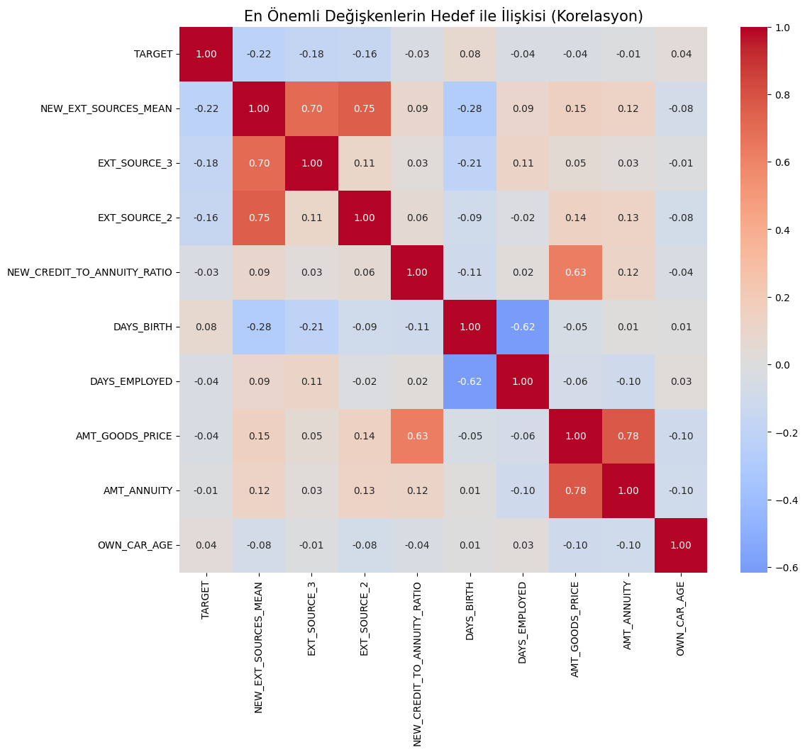 | 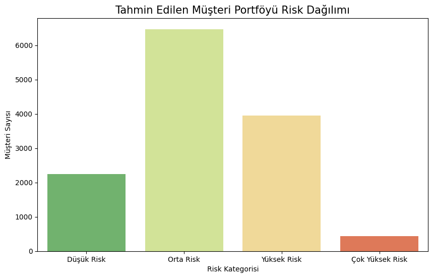 |

---

## 🚀 Business Recommendations

Elde edilen sonuçlara göre yönetim için aksiyon planı:

1.  **Risk Odaklı Limit:** "Bekar" segmentindeki müşteriler için kredi limitleri daha konservatif belirlenmelidir.
2.  **Vade Sınırlaması:** Risk skoru belirli bir seviyenin üzerinde olan müşterilerde vade süresi kısaltılarak risk minimize edilmelidir.
3.  **Erken Uyarı:** Dış kredi skoru düşük gelen başvurular otomatik incelemeye alınmalıdır.

---

## 📊 BI & Reporting Dashboard (Looker Studio)

Model çıktılarını, müşteri segmentlerini ve risk faktörlerini analiz etmek için **Google Looker Studio** kullanılarak kapsamlı bir raporlama seti hazırlanmıştır.

| 1. Özet Metrikler & KPI (Ana Ekran) | 2. Müşteri Demografisi |
|:-----------------------------------:|:----------------------:|
| 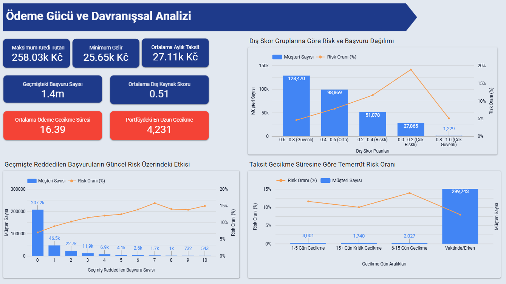 | 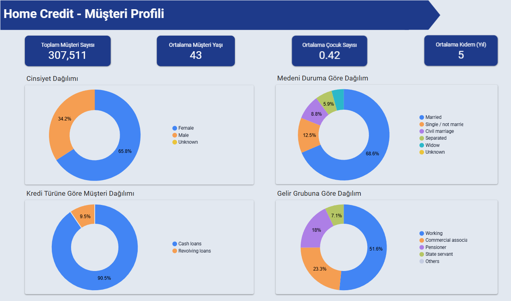 |
| **3. Risk Segmentasyonu & Analiz** | **4. Bölgesel Dağılım & Skorlama** |
| 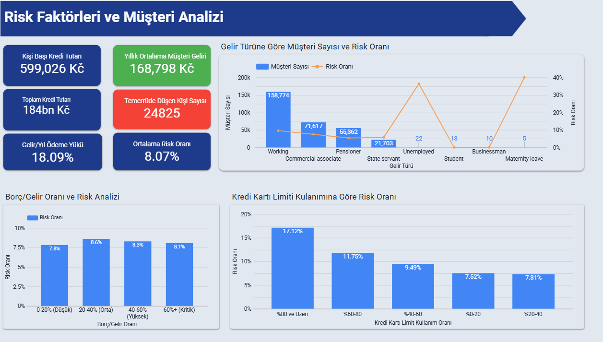 | 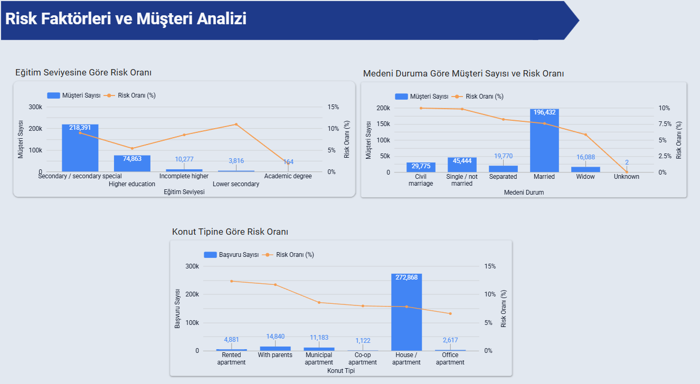 |

> **Not:** Görseller, projenin canlı raporlama ekranlarından alınmıştır.

---

## 📂 Repository Structure

* `notebooks/`: Jupyter Notebook (.ipynb) kod dosyaları.
* `data/`: Veri şeması ve örnek veriler.
* `images/`: Proje görselleri (ROC, SHAP, Matrix vb.).
* `submission.csv`: Final tahmin dosyası.
* `requirements.txt`: Gerekli kütüphaneler.

---

## 🤝 Authors

- [Emirhan Kümüş](https://github.com/emirhankumus)
- [Zehra İstemihan](https://github.com/zistemihan)
- [Cem Özdoğan](https://github.com/gcemozdogan)
- [Cevdet Kopuz](https://github.com/cevdetkopuz)

